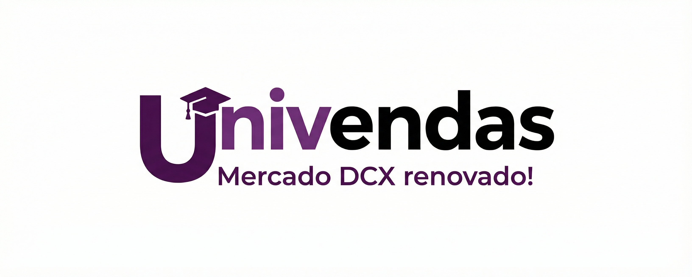

<h1 align="center">


Univendas - Mercado DCX
</h1>
<div align="center">
  
<p align="center">


</p>
</div>

<h3>💻 Sobre o Projeto</h3>

O Univendas é uma plataforma web desenvolvida para revitalizar o mercado do DCX (Departamento de Computação Exata). O objetivo é conectar estudantes e membros da comunidade acadêmica, facilitando a compra, venda e troca de produtos como eletrônicos, materiais de estudo, móveis e muito mais.

O projeto foca em uma interface intuitiva, responsiva e moderna.

<h3>✨ Funcionalidades</h3>

🔐 Autenticação Segura: Login e cadastro de usuários com proteção de rotas (JWT).

👤 Perfil de Usuário: Gerenciamento de dados pessoais e foto de perfil.

🛒 Gestão de Produtos:

- Cadastro de novos produtos com imagens.

- Listagem completa de itens à venda.

- Edição e exclusão de produtos próprios.

🔍 Busca Inteligente: Pesquisa de produtos por nome em tempo real.

📱 Contato Fácil: Integração direta com o WhatsApp do vendedor.

🎨 Design Responsivo: Adaptável para desktops, tablets e smartphones.

<h3>🛠 Tecnologias Utilizadas</h3>

Este projeto foi desenvolvido utilizando as seguintes tecnologias:

- React: Biblioteca para construção da interface.

- Vite: Ferramenta de build rápida e leve.

- Tailwind CSS: Framework CSS para estilização ágil.

- React Router Dom: Gerenciamento de rotas e navegação SPA.

- Axios: Cliente HTTP para comunicação com a API.

- JWT Decode: Decodificação de tokens de autenticação.

- Headless UI & Heroicons: Componentes acessíveis e ícones.

<h3>🚀 Como Executar o Projeto</h3>

Pré-requisitos

- Certifique-se de ter o Node.js e o NPM instalados em sua máquina. Além disso, é necessário que o Back-end da aplicação esteja rodando (padrão em http://localhost:8080).

Passo a Passo

Clone o repositório

```
git clone [https://github.com/KaweVK/univendas-web.git](https://github.com/KaweVK/univendas-web.git)
cd univendas-web
```

Instale as dependências

```
npm install
```


Configuração de Variáveis de Ambiente
Crie um arquivo .env na raiz do projeto (se necessário) para configurar a URL da API:

```
VITE_API_URL=http://localhost:8080
```


Execute o projeto

```
npm run dev
```


Acesse no navegador
O projeto estará rodando em: http://localhost:5173

📂 Estrutura de Pastas

```
src/
├── assets/          # Assets estáticos do Vite
├── componentes/     # Componentes reutilizáveis (Botões, Cards, NavBar, etc.)
├── pages/           # Páginas da aplicação (Login, Home, Produto, etc.)
├── services/        # Configuração da API (Axios)
└── public/          # Imagens e ícones públicos
```

<div align="center">

</div>
